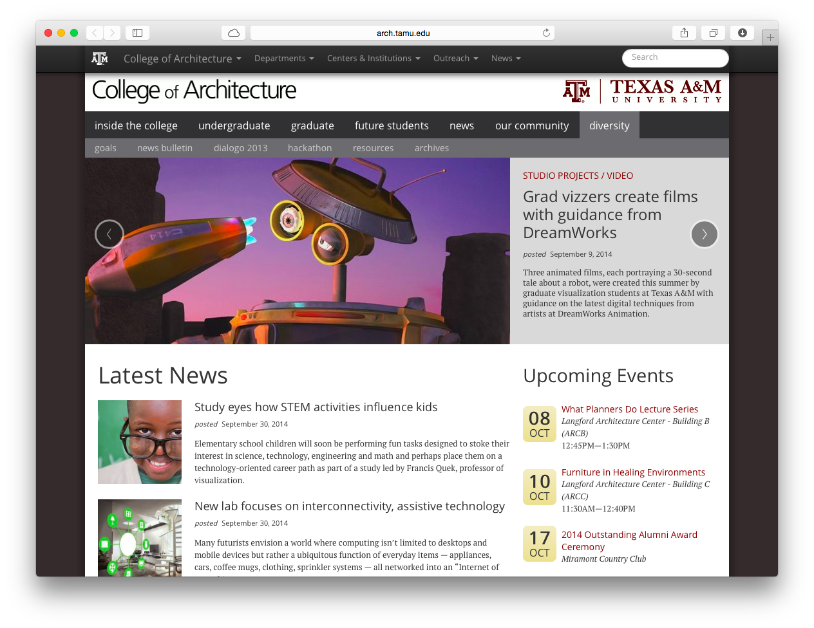

footer: Adam Mikeal — Texas A&M University — PM Exchange 2014
slidenumbers: true


#[fit]Culture Shift

##[fit]How DevOps changed </br>the way we think about IT

^ 
I like to read Wikipedia for fun (joke)
Favorite articles are the "lists of things" -- cognitive biases; latin phrases; global metropolitan areas by population
Found a new favorite: Culture-bound syndromes

---


^
Defined as -- a combination of psychiatric and somatic symptoms that are considered to be a recognizable disease only within a specific society or culture. 
Think about that for a minute

---


^ 
Paris syndrome: a transient psychological disorder encountered by some individuals visiting or vacationing in Paris. It is characterized by a number of psychiatric symptoms such as acute delusional states, hallucinations, feelings of persecution...
According to several medical journals, Japanese visitors are observed to be especially susceptible.

---


^ 
My favorite: Jerusalem Syndrome -- phenomenon whereby a person who seems previously balanced and devoid of any signs of psychopathology becomes psychotic after arriving in Jerusalem.
Types (types!)
Type I -- affected person believes themself to be a Messiah
Type III -- variety of behaviors, including the preparation -- often with the aid of hotel bed-linen -- of a long, ankle-length, toga-like gown, which is always white

---

#[fit]Culture Shift

##[fit]How DevOps ~~changed~~ changes </br>the way we think about IT

^ 
Brings us back to our topic today -- essentially the story of our journey at the College of Architecture over the past year or so
CHANGED implies finality -- we are certainly not finished our journey. We are still learning how to apply these ideas and improve

---

# Roadmap

1. Why Culture?
1. Our Context
1. Meet DevOps
1. Open Discussion

---

# Culture

> The outlook, attitudes, values, morals, goals, and customs shared by a group.

^ 
We've all seen this definition before

---

# Culture (more simply)

> Culture is the way you think, act, and interact

^ 
IMPORTANT: much of culture is invisible -- assumptions -- background process

---

# The Context

### The College of Architecture at </br>Texas A&M

---

# College of Architecture

- 4 departments
- 8 research centers and institutes
- 450 employees
- 8000 students
- locations across Texas and the globe

---



^
Work we do: web; infrastructure; business applications; automated tools to manage student accounts and data (!!); classroom technology; rendering pipeline and infrastructure

---

# The Problem

### Do we have a problem?
### IT has always been like this

^
No dramatic stories of epic failure, just regular IT woes -- fighting fires, can't seem to get ahead, can't seem to effectively coordinate operations and development
~18 months ago, one of my employees (UNIX admin) started looking at automating parts of his job
Several attempts, some false starts, then he came into my office one day and said --

---

# The Solution


^
"Dude -- you HAVE to read this book"
So I did -- in one sitting. It just clicked. 
Then I bought copies for all my team, and made them read it too (Really. I assigned it.)

---

# The Phoenix Project

A management fable in the style of E. Golrdratt's *The Goal*.

Theory of Constraints — Systems management

^
The Goal was a book published in 1984 about systems management and his Theory of Constraints. 
The surprise is that a 30-y-o business theory about manufacturing has so many things to teach us about IT.
Summarize TPP -- Bill takes over failing project, cast of characters (archetypes); you'll all recognize at least a few
Meets a mentor that helps him understand why his inherited IT project is failing and how to fix it -- DevOps

---

# What is DevOps?

> DevOps is a service delivery concept that stresses communication, collaboration, and integration between software developers and IT professionals.

#### [DevOps, from Wikipedia](http://en.wikipedia.org/wiki/DevOps)

---

# What is DevOps (alternative edition):

> Developers need to understand infrastructure. Operations people need to understand code. People need to f**king work with each other and not just occupy space next to each other.
-- John Vincent

#### [DevOps - the Title Match from blog dot lusis](http://blog.lusis.org/blog/2013/06/04/devops-the-title-match/)

^
John Vincent is a systems engineer currently at Dell

---

</br> </br>
# [fit] DevOps : Operations :: Agile : Development

^
Was reminded earlier that early on DevOps was even called "Agile operations"

---

# DevOps seeks to maximize:

- predictability
- efficiency
- security
- maintainability

^
PRED: you want to be sure that every time a system is changed you know what state it is in
EFF: dev cycles are faster and faster -- very long build times are no longer reasonable
SEC: if you have no control over the changes, you have lack security
MAIN: 80% of a system's lifecycle is in maint., not dev -- any model that doesn't address this FAILS

---

# DevOps emphasizes:  

- automation whenever possible
- infrastructure as code
- disaster _indifference_ over recovery
- continuous integration / delivery

---

## So documentation doesn't look like this—

1. Download the `nginx` binaries form the website
2. Edit the conf file to point to the correct data dir `/root/path/to/dir`
3. Somtehing else complicated and technical `$like_this` in this step
4. And another thing that wraps multiple complex steps in a single, inadequate sentence
5. And the list continues *ad nauseum*...

^
We've all seen this -- we've probably asked for documentation like this to be created before. 
But (almost) no one likes to do this -- almost impossible.
And no one reads it. And it doesn't stay in sync with reality.

---

# But rather, like this—

```
include_recipe 'nginx'
include_recipe 'git'

directory '/var/www' do
 action :create
 owner 'www-data'
 group 'www-data'
end

git node['magic']['directory'] do
 user 'www-data'
 group 'www-data'
 reference 'master'
 repo 'git://github.com/TAMUArch/magic'
end

template '/etc/nginx/sites/magic' do
 action :create
 source 'magic.conf.erb'
end

...
```

^
If the only way to build this server is to run this code, then you are guaranteed that the documentation (the CODE) is in sync with the running service

---

# Main lessons from The Phoenix Project

1. There are 4 types of work
2. Work-in-progress is the silent killer
3. Unplanned work accrues technical debt
4. Bottlenecks contrain work

^
After I "assigned" the book to my staff, we held a 1-day retreat -- left the office, and spent all day working through the book.

---


# Four types of work

1. Business projects
2. Infrastructure projects
3. Changes
4. Unplanned work

^
Explain the 4 types
We then spent almost another day in a "war room" with stacks of colored index cards
Trying to get a handle on the amount of work we had in progress


---

# The Three Ways

1. Systems thinking
2. Amplify feedback loops
3. Culture of continual experimentation and learning

^
The "ways" were the lessons imparted to the main character in the book by the mentor
1st way emphasizes the performance of the entire system -- everyone must be concerned with the final product, and take ownership (no throw over)
2nd way talks about feedback from ops back to dev so that improvements can be made
3rd way is about creating a CULTURE of continual experimentation and improvement

---

# Back to Culture

### Changes we made in Architecture were mostly about culture

^
Got people talking
Weekly change management meeting so any changes to systems were broadcast to all members of the team
We've experimented with various Kanban software tools -- still learning here
Better handle on work capacity than ever before
DevOps syncs well with a framework like ITIL because DevOps is primarily a way to get your team thinking about the final **service** that is delivered, and not just the narrow slice they see from their desk.

---

# More reading
On DevOps and organizational culture:

## Empathy: The Essence of DevOps </br>[http://blog.ingineering.it/post/72964480807/empathy-the-essence-of-devops](http://blog.ingineering.it/post/72964480807/empathy-the-essence-of-devops)
## DevOps Culture (Part 1) </br>[http://itrevolution.com/devops-culture-part-1/](http://itrevolution.com/devops-culture-part-1/)
## Continuously Deploying Culture: Scaling Culture at Etsy </br>[http://www.slideshare.net/mcdonnps/continuously-deploying-culture-scaling-culture-at-etsy-14588485](http://www.slideshare.net/mcdonnps/continuously-deploying-culture-scaling-culture-at-etsy-14588485)

---

# More reading
On DevOps methodologies:

## __The Phoenix Project: A novel about IT, DevOps, and helping your business win__ (IT Revolution Press) </br>[http://itrevolution.com/books/](http://itrevolution.com/books/)
## Where To Learn More About Concepts In "The Phoenix Project" (Part 1) </br>[http://itrevolution.com/learn-more-about-concepts-in-phoenix-project/](http://itrevolution.com/learn-more-about-concepts-in-phoenix-project/)

---

# About me

https://github.com/amikeal
https://github.com/TAMUArch

`adam@tamu.edu`

---

# Open discussion